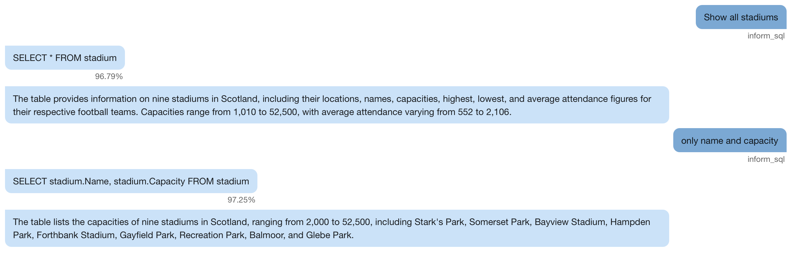
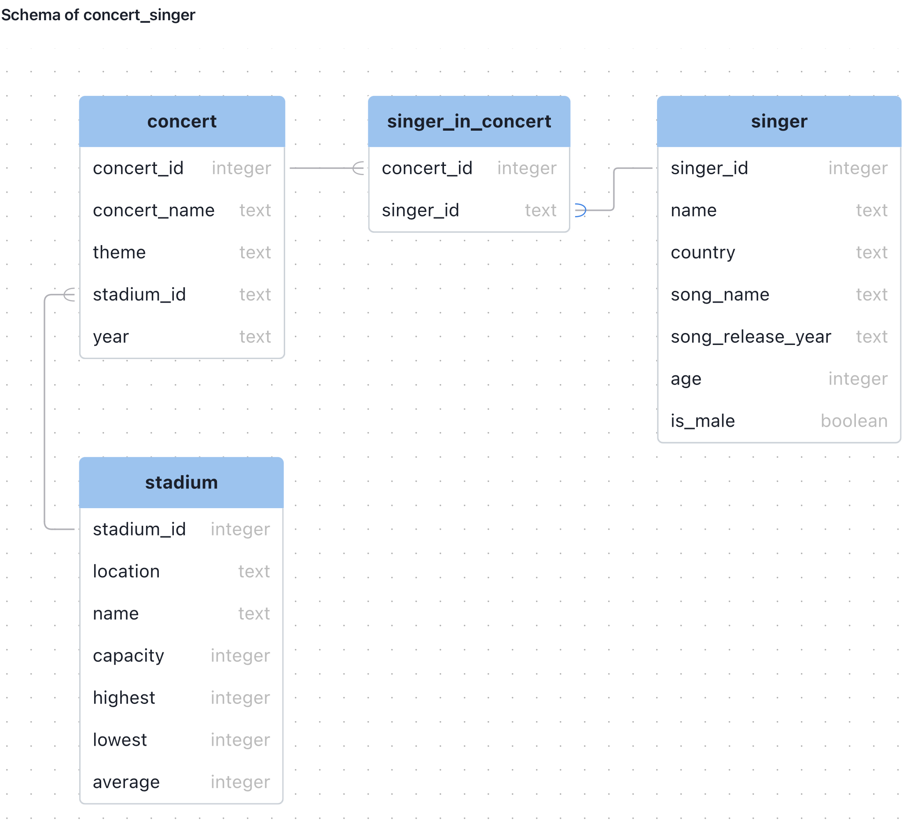
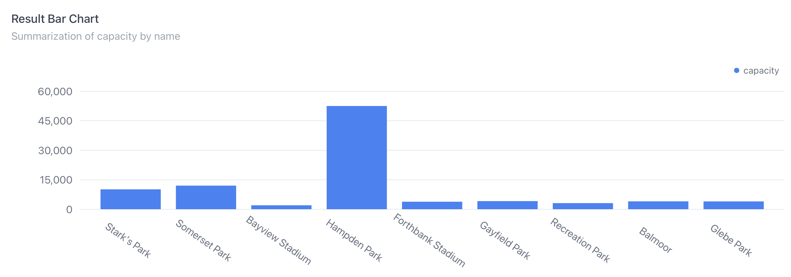
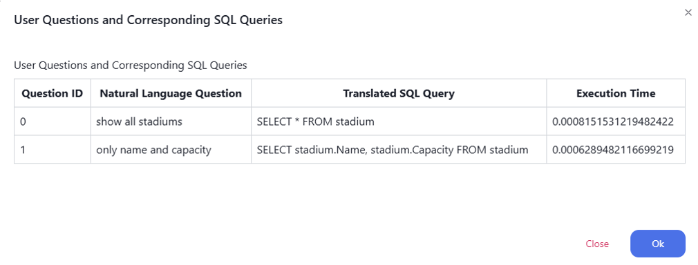
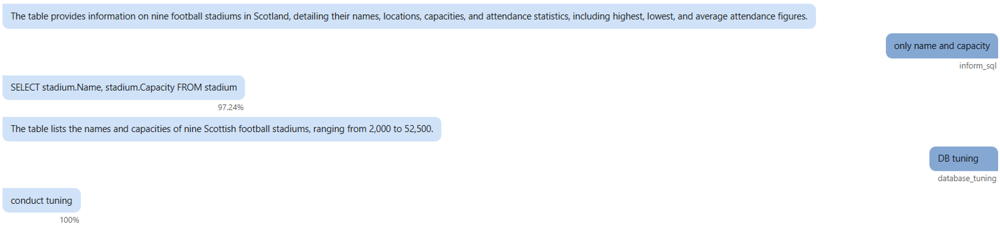
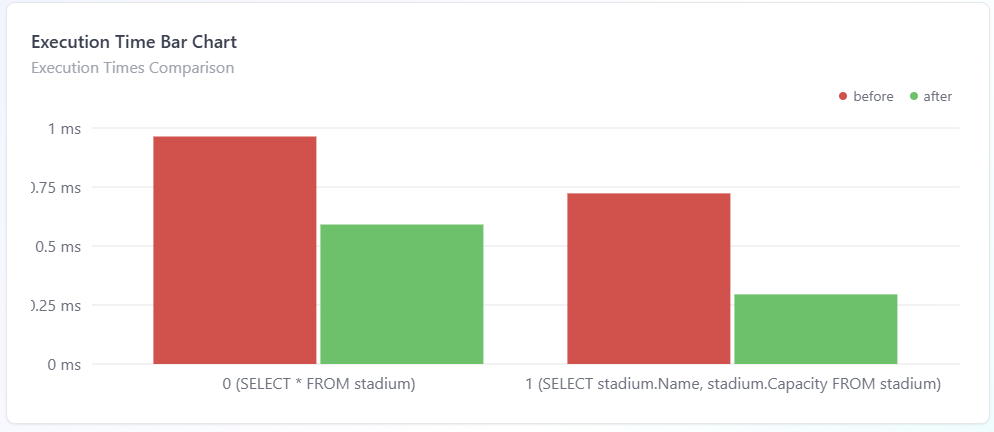
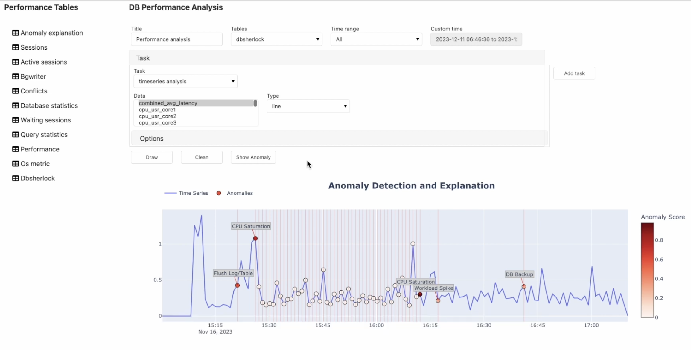

# Conversational Self-Tuning DBMS

A research project on building an intelligent database management system that understands natural language, detects anomalies, and tunes itself automatically.


---

## Project Overview

This multi-year research project (2018-2025) developed two main systems: **DBAdminBot**, a conversational database chatbot that translates natural language to SQL and performs automatic DBMS tuning, and **EDAframework**, a database performance anomaly detection and root cause analysis platform. Both systems are packaged as Docker-based demos for easy deployment.

## Research Phases

| Phase | Period | Focus |
|-------|--------|-------|
| Phase 1 | 2018-2021 | Conversational natural language query processing (NL-to-SQL) |
| Phase 2 | 2022-2023 | NL generation, confidence-based query clarification, anomaly detection |
| Phase 3 | 2024-2025 | Automatic DBMS tuning and anomaly resolution |

---

## DBAdminBot Features

| Feature | Phase | Description |
|---------|-------|-------------|
| Conversational NL2SQL | Phase 1 | Translate natural language questions into SQL using RAT-SQL with conversational context |
| Schema Visualization | Phase 1 | Interactive database schema explorer |
| SQL Result Visualization & NL Generation | Phase 2 | Chart/table rendering of query results with natural language summaries |
| Confidence-Based Query Clarification | Phase 2 | Low-confidence queries trigger clarification using Captum attribution |
| Workload History Visualization | Phase 2 | Visual timeline of database workload patterns |
| Knob Tuning Execution | Phase 3 | Automated database configuration tuning via OpAdviser |
| Knob Tuning Result Visualization | Phase 3 | Before/after comparison of tuning outcomes |

### Screenshots

| | |
|:---:|:---:|
| <br/>*Conversational NL2SQL* | <br/>*Schema Visualization* |
| <br/>*SQL Result Visualization & NL Generation* | <br/>*Workload History Visualization* |
| <br/>*Knob Tuning Execution* | <br/>*Knob Tuning Result Visualization* |

---

## EDAframework Features

**EDAframework** (Database Experimental Data Analysis Framework) provides database performance anomaly detection and root cause analysis. It collects metrics from PostgreSQL/MySQL databases, trains ML models for anomaly detection, and offers interactive Jupyter-based visualization.

- Metric collection from PostgreSQL and MySQL via pluggable collectors
- ML-powered anomaly detection (DBAnomTransformer)
- DBSherlock-based anomaly root cause explanation
- Interactive dashboard with Panel/ipywidgets in Jupyter Lab

<p align="left">
  
  <br/><em>EDAframework Dashboard</em>
</p>

---

## Architecture

### DBAdminBot

```
                   +-----------------+
                   |   Frontend      |  port 3000 (Next.js)
                   |   (DBAdminBot)  |  + PostgreSQL 5434
                   +--------+--------+
                            |
              +-------------+-------------+
              |                           |
    +---------v---------+       +---------v---------+
    |   Backend         |       |   OpAdviser       |  port 1234 (Flask)
    |   port 7000       |       |   (Knob Tuning)   |  + MySQL 3308
    +--------+----------+       +-------------------+
             |
    +--------v----------+       +-----------------+
    |   Redis           |       |   LLM (SGLang)  |
    |   port 6379       |       |   port 30000    |
    +-------------------+       +-----------------+
```

### EDAframework

```
    +-----------------------+       +-----------------------+
    |   Client              |       |   Server              |
    |   Jupyter Lab :8888   | ----> |   Flask API :85       |
    |   + PostgreSQL 5438   |       |   + PostgreSQL 5437   |
    |   (Target DB)         |       |   (Metric Store)      |
    +-----------------------+       +-----------------------+
```

### Docker Services

| Service | Image | Ports | GPU |
|---------|-------|-------|-----|
| DBAdminBot-frontend | `anonymous824/dbadminbot_frontend:latest` | 3000 | No |
| DBAdminBot-backend | `anonymous824/dbadminbot_backend:latest` | 7000, 30000 | Yes |
| DBadminBot-redis | `redis:latest` | 6379 | No |
| DBAdminBot-opadvisor | `anonymous824/dbadminbot_tuning:latest` | 1234 | No |
| DBEDA-server | `anonymous824/dbeda_server:latest` | 85, 5437 | Yes |
| DBEDA-client | `anonymous824/dbeda_client:latest` | 8888, 5438 | Yes |

---

## Code Structure

```
source/                  Core ML modules
  text2sql/                Text-to-SQL translation (RAT-SQL)
  text2intent/             User intent classification
  conversation/            NL generation, confidence scoring, LLM integration
  diagnosis/               Query analysis and anomaly detection
  tuning/                  Database tuning (OpAdviser)
demo/                    Demo applications
  dbadminbot/              DBAdminBot frontend (Next.js) and backend (Flask)
  edaframework/            EDAframework server and client
config/                  Hydra YAML configurations
scripts/                 Demo launch scripts
docker-compose.yml       All service definitions
```

---

## Getting Started

### Prerequisites

- Docker 20.10+ with Compose v2
- NVIDIA Container Toolkit (`nvidia-docker2`)
- 2+ GPUs (24GB+ VRAM each recommended)
- 32GB+ RAM
- ~140GB disk (64GB model data + 72GB Docker images)
- Model checkpoints at `/mnt/sdd/shpark/` (see [docs/deployment-guide.md](docs/deployment-guide.md))

Verify your environment:

```bash
docker --version
docker compose version
nvidia-smi
docker run --rm --gpus all nvidia/cuda:12.1.0-base-ubuntu22.04 nvidia-smi
```

### Quick Start: DBAdminBot

**Option A: Launch script (recommended)**

```bash
bash scripts/run_dbadminbot.sh
```

**Option B: Manual steps**

```bash
# 1. Start containers
docker compose up -d DBAdminBot-frontend DBAdminBot-backend DBadminBot-redis DBAdminBot-opadvisor

# 2. Start Frontend
docker exec -d DBAdminBot-frontend bash -c \
    "service postgresql start && cd /root/dbadminbot/web && npm run dev"

# 3. Start Backend (auto-starts LLM)
docker exec -d DBAdminBot-backend bash -c \
    "cd /root/dbadminbot && python backend_server_v2.py"

# 4. Access at http://localhost:3000
```

### Quick Start: EDAframework

**Option A: Launch script (recommended)**

```bash
bash scripts/run_edaframework.sh
```

**Option B: Manual steps**

```bash
# 1. Start containers
docker compose up -d DBEDA-server DBEDA-client

# 2. Start Server (PostgreSQL + Flask API)
docker exec -d dbeda_server bash -c \
    "service postgresql start && cd /root/DBEDA/server && \
     PYTHONPATH=/root/DBEDA/server:/root/DBEDA python3 server.py"

# 3. Start Client (PostgreSQL + Jupyter Lab)
docker exec -d dbeda_client bash -c \
    "service postgresql start && cd /root/DBEDA/client && \
     PYTHONPATH=/root/DBEDA:/root/DBEDA/client \
     jupyter lab --allow-root --ip=0.0.0.0 --port=8888 --no-browser --ServerApp.token=''"

# 4. Open http://localhost:8888 and run DBEDA.ipynb
```

### Stop All Services

```bash
bash scripts/stop_all.sh
# or: docker compose down
```

---

## Test Cases

### DBAdminBot

Step-by-step test scenario using the `concert_singer` database:

1. **Select Database** — Choose `concert_singer` as the target database.

2. **Invalid Table Query (Confidence-Based Clarification)** — Type: `show all animals`
   - Expected: Returns `/* No animals table in the provided schema. */` with a low confidence score (~66%)
   - The system asks: *"I'm not sure if I understand your question. Are you sure you mean 'animals'?"*
   - This demonstrates the confidence-based query clarification feature.

3. **Simple Aggregation Query** — Type: `For each stadium, how many concerts have been held there?`
   - Expected SQL:
     ```sql
     SELECT s.Name, COUNT(c.concert_ID) AS concert_count
     FROM stadium s LEFT JOIN concert c ON s.Stadium_ID = c.Stadium_ID
     GROUP BY s.Name
     ```

4. **Complex Subquery** — Type: `Show me the unique concert IDs and stadium capacities for all concerts that were held in stadiums whose capacity is less than the average capacity of stadiums located in Peterhead.`
   - Expected SQL:
     ```sql
     SELECT concert.concert_ID, stadium.Capacity
     FROM concert JOIN stadium ON concert.Stadium_ID = stadium.Stadium_ID
     WHERE stadium.Capacity < (
       SELECT AVG(stadium.Capacity) FROM stadium WHERE stadium.Location = 'Peterhead'
     )
     ```

5. **Conversational Context Follow-up** — Type: `Include the stadium IDs as well.`
   - Expected: The system correctly uses conversational context to add `stadium.stadium_ID` to the previous query.
   - Expected SQL:
     ```sql
     SELECT concert.concert_ID, stadium.stadium_ID, stadium.Capacity
     FROM concert JOIN stadium ON concert.Stadium_ID = stadium.Stadium_ID
     WHERE stadium.Capacity < (
       SELECT AVG(stadium.Capacity) FROM stadium WHERE stadium.Location = 'Peterhead'
     )
     ```

6. **DBMS Knob Tuning** — Type: `Optimize the DBMS for workload history.`
   - Expected: The system detects tuning intent and initiates automated knob tuning via OpAdviser.

### EDAframework

Step-by-step demo scenario using the Jupyter Lab interface at `http://localhost:8888`:

1. **Launch & Initialize** — Open `DBEDA.ipynb`, set configuration, connect to database, and call the visualization function.

2. **Explore the Dashboard** — The visualization window has two main components:
   - **Performance Table** (left): Shows available log data tables stored in the database.
   - **DB Performance Analysis** (right): Interactive analysis panel for log data.

3. **Configure Analysis** — Fill in a title for saving results, then select a data table to analyze (e.g., OS Metrics).

4. **Set Time Range** — Select the time range for analysis (e.g., full time range).

5. **Select Analysis Task** — Choose a task type. For basic time series data analysis, select **Time Series**.

6. **Visualize Metrics** — Select a metric (e.g., Disk Write Bytes) and click **Draw** to display the time series graph. Add more metrics to compare them side by side.

7. **Explore Additional Datasets** — Switch to other datasets such as **DBSherlock** to analyze metrics like Combined Average Latency, CPU User Core, etc.

8. **Detect Anomalies** — Click **Show Anomaly** to run the anomaly detection model (DBAnomTransformer).
   - Anomaly intervals are highlighted with red circles on the graph.
   - Each interval is labeled with a predicted root cause (e.g., CPU Saturation).

9. **Root Cause Analysis** — The framework automatically filters and displays only the metrics related to the predicted root cause (e.g., CPU System Core metrics), reducing the number of metrics to examine.

10. **Verify Results** — Confirm that CPU core usage is elevated in the predicted anomaly intervals, validating the model's detection.

---

## Volume Mounts Reference

### DBAdminBot

| Host Path | Container Path | Purpose |
|-----------|---------------|---------|
| `./demo/dbadminbot/frontend` | `/root/dbadminbot` | Next.js frontend source |
| `./demo/dbadminbot/backend` | `/root/dbadminbot/` | Backend source |
| `./source` | `/root/dbadminbot/source` | ML module source code |
| `./config` | `/root/dbadminbot/config` | Hydra configuration files |
| `redis_data` (volume) | `/root/dbadminbot/data/redis/` | Redis persistent data |
| `/var/run/docker.sock` | `/var/run/docker.sock` | SGLang container launch |
| `/mnt` | `/mnt` | Model checkpoints & LLM access |
| `./source/tuning/OpAdviserPrivate` | `/workspaces/OpAdviserPrivate` | OpAdviser source |
| `/mnt/sdd/shpark/OpAdviser/lib` | `/usr/local/lib` | OpAdviser Python libraries |
| `opadvisor_mysql` (volume) | `/var/lib/mysql` | OpAdviser MySQL data |

### EDAframework

| Host Path | Container Path | Purpose |
|-----------|---------------|---------|
| `./demo/edaframework` | `/root/DBEDA` | Full EDA project (server + client) |

---

## Configuration Reference

| Config File | What to Modify |
|-------------|---------------|
| `docker-compose.yml` | Image names, volume mount paths |
| `config/remote/llm.yaml` | GPU IDs, LLM model path, mount paths |
| `config/text2sql/default.yaml` | Text2SQL model checkpoint path |
| `config/text2intent/default.yaml` | Intent model checkpoint path |
| `config/conversation/text2confidence/default.yaml` | Confidence model checkpoint path |
| `config/data/spider.yaml` | Spider dataset path |
| `demo/dbadminbot/frontend/web/.env` | `MODEL_API_ADDR` (backend URL) |
| `demo/edaframework/config.json` | Port numbers, DBSherlock model paths |

See [docs/deployment-guide.md](docs/deployment-guide.md) for the full deployment guide.

---

## Related Repositories

| Year | Repository | Description | Stars | Forks | Contributors |
|------|-----------|-------------|-------|-------|--------------|
| 2025 | [Conversational-Self-tunning-DBMS](https://github.com/postechdblab/Conversational-Self-tunning-DBMS) | Main project repository |  |  |  |
| 2024 | [SQLBot](https://github.com/hyukkyukang/SQLBot) | Conversational DB chatbot |  |  |  |
| 2024 | [OpAdviserPrivate](https://github.com/seokjeongeum/OpAdviserPrivate) | Database knob tuning |  |  |  |
| 2023 | [Anomaly_Explanation](https://github.com/pshlego/Anomaly_Explanation) | Anomaly diagnosis module |  |  |  |
| 2023 | [DBSherlock](https://github.com/hyukkyukang/DBSherlock) | DBSherlock Python implementation |  |  |  |
| 2023 | [PRODA](https://github.com/hyukkyukang/PRODA) | Progressive data augmentation |  |  |  |
| 2022 | [text2SQL](https://github.com/hyukkyukang/text2SQL) | Text-to-SQL translation model |  |  |  |
| 2022 | [table-to-text](https://github.com/hyukkyukang/table-to-text) | Table-to-text summarization model |  |  |  |
| 2022 | [EDA_Framework](https://github.com/jeha-dblab/EDA_Framework) | DB experimental data analysis framework |  |  |  |
| 2020 | [qgm_decoder](https://github.com/inyukwo1/qgm_decoder) | QGM decoder for SQL generation |  |  |  |
| 2020 | [tree-lstm](https://github.com/inyukwo1/tree-lstm) | Tree-LSTM implementation |  |  |  |
| 2020 | [NL2SQL](https://github.com/postech-db-lab-starlab/NL2SQL) | NL to SQL: Where are we today? |  |  |  |
| 2020 | [FixMatch-pytorch](https://github.com/LeeDoYup/FixMatch-pytorch) | FixMatch PyTorch implementation |  |  |  |
| 2019 | [LSS-Similarity](https://github.com/postech-db-lab-starlab/LSS-Similarity) | LSS similarity measure |  |  |  |
| 2019 | [Web-Crawler-for-NL2SQL](https://github.com/postech-db-lab-starlab/Web-Crawler-for-NL2SQL) | Web crawler for NL2SQL data |  |  |  |
| 2019 | [spider-heuristic](https://github.com/postech-db-lab-starlab/spider-heuristic) | Spider dataset heuristics |  |  |  |
| 2019 | [Coarse2fine_boilerplate](https://github.com/postech-db-lab-starlab/Coarse2fine_boilerplate) | Coarse-to-fine boilerplate |  |  |  |
| 2019 | [ATHENA](https://github.com/postech-db-lab-starlab/ATHENA) | ATHENA NL interface |  |  |  |
| 2019 | [text-to-sql-models](https://github.com/inyukwo1/text-to-sql-models) | Text-to-SQL development environment |  |  |  |
| 2019 | [syntaxsqlnet_frompredict](https://github.com/inyukwo1/syntaxsqlnet_frompredict) | SyntaxSQLNet implementation |  |  |  |

---

## License

This project is licensed under the Apache License 2.0. See [LICENSE](LICENSE) for details.
